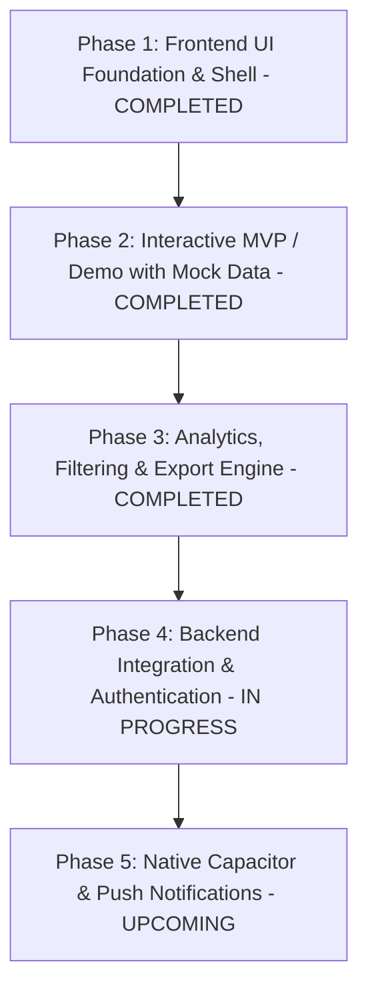

# NHS Trainee Feedback Platform - Implementation Plan

A modern, responsive cross-platform application (Ionic 9 + Angular Standalone + Capacitor) designed for London NHS regional trainee representatives and junior doctors. Replaces scattered Google Forms and WhatsApp links with centralized, targeted feedback distribution, dynamic surveys, safeguarding escalation, and actionable training insights.

---

## User Requirements & Decisions Summary

| Area | Decision & Design |
| :--- | :--- |
| **Authentication & Access Control** | **Sign In / Sign Out System**:  Demo switcher replaced with a dedicated NHS-branded login screen (`/login`), functional route guards (`authGuard`, `roleGuard`), and secure session termination from the Profile tab.  **Test Credentials:** - **Trainee Doctor:** `username: trainee`, `password: trainee1` - **Regional Rep:** `username: rep`, `password: rep1` - **Admin:** `username: admin`, `password: admin1` |
| **Roles & Privileges** | **Trainee:** Fills targeted feedback forms, selects department, can flag serious incident. **Regional Rep:** Creates & publishes surveys, reviews aggregated analytics & exports to Excel. **Admin:** Full visibility/control of all Rep tools, plus approves Reps, manages Hospitals/Trusts/Sectors, and oversees safety incident investigations. |
| **Anonymity & Safeguarding** | **Anonymous by default**: Reps only see anonymized feedback.  **Un-anonymization Exception**: If an investigation is formally required, the **Admin** has the authority to un-anonymize the author with a permanent audit log, or dismiss/remove the safety flag. |
| **Hierarchy & Targeting** | **London Region** -> **Sectors** (NCL, NEL, NWL, SL) -> **NHS Trusts** -> **Individual Hospitals**. Admin can manage hospitals and trusts directly from the portal. |
| **Analytics & Reporting** | **Reactive Filter Engine**: Multi-criteria filters with real-time reactive signals, collapsible filter drawer, KPI cards, rating distribution chart, and simple one-click **Export to Excel** (.csv). |

---

## Phased Project Roadmap Status

